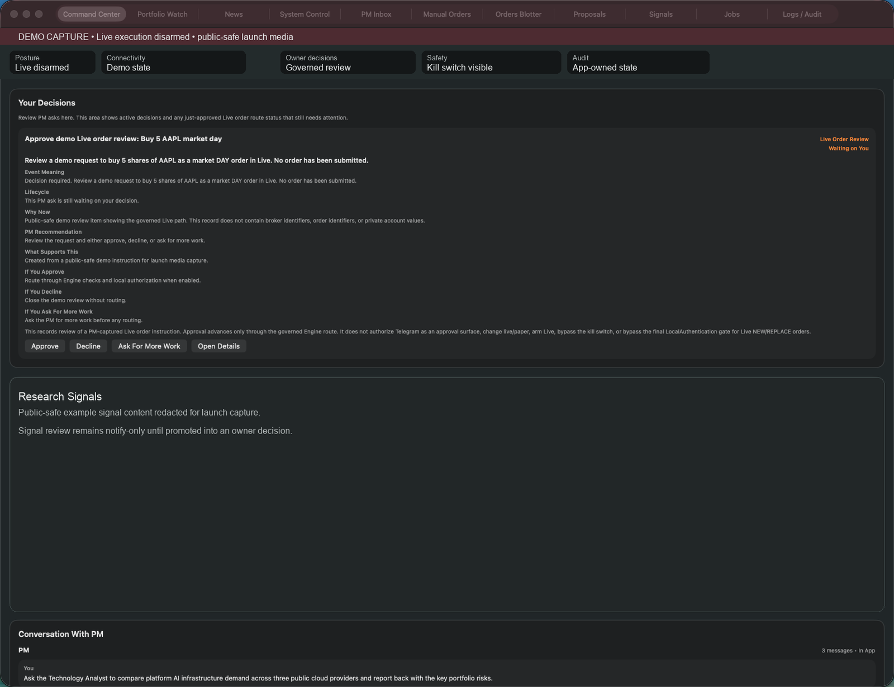
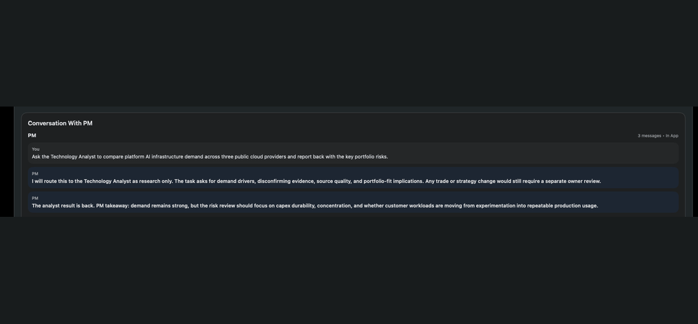
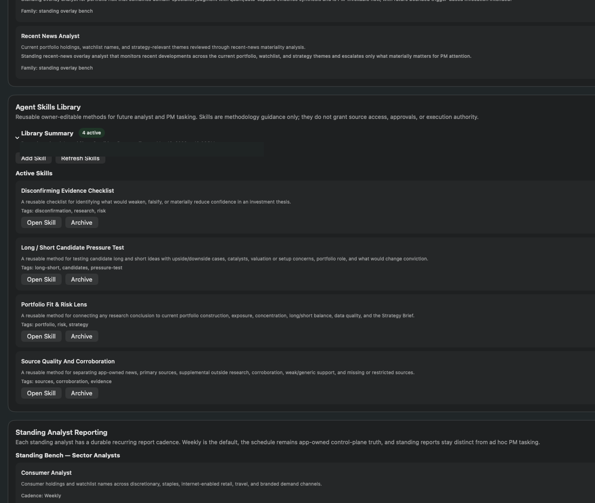
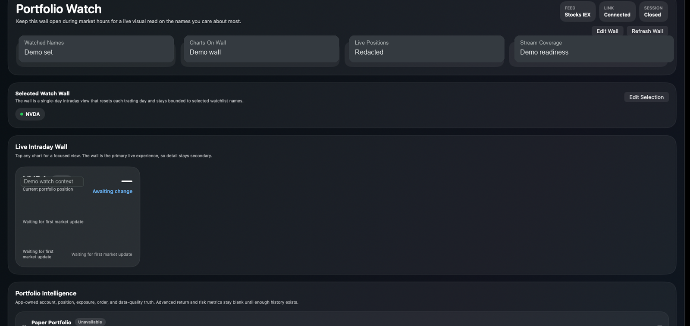
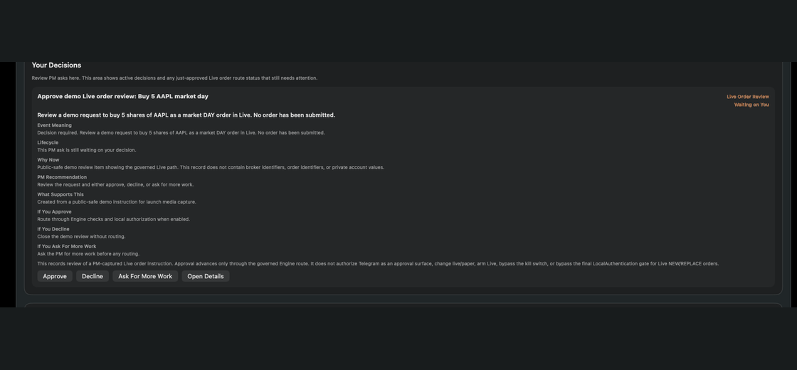
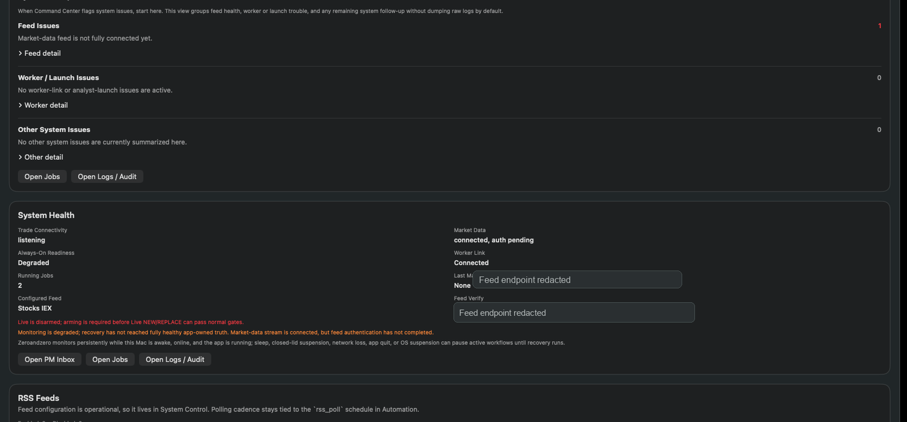

# ZeroandZero

ZeroandZero™ is a local-first macOS SwiftUI trading workstation and agentic research control plane built around a UI-agnostic `TradingKit` core.

The project combines a governed trading shell, Alpaca connectivity, portfolio/watchlist surfaces, PM and analyst workflows, provider-aware LLM runtime seams, and durable local persistence. It is intended for developer/operator experimentation and is not investment advice. It is not a hosted trading bot, robo-advisor, copy-trading product, or promise of automated returns.

## What ZeroandZero Includes

- macOS SwiftUI app sources under `MacApp/AlgoTradingMac`
- `TradingKit`, a Swift package containing the engine, store, broker/runtime integrations, IPC surface, persistence models, analyst/PM support, and tests
- local IPC tools and smoke executables
- public-safe architecture, safety, configuration, development, and contribution docs

## What ZeroandZero Does Not Include

This repo intentionally does **not** ship:
- real API keys, tokens, or account identifiers
- local runtime state or Keychain values
- pre-loaded strategy documents, analyst charters
- analyst reports, schedules, runtime settings, private/user-specific feed state, or screenshots containing private data

## Product Surface

ZeroandZero is a local macOS workstation, not a hosted bot. The app gives the owner governed surfaces for PM communication, analyst work, portfolio monitoring, approvals, runtime configuration, and safety controls.



Command Center: owner-facing PM conversation, analyst activity, decision review, signals, and system health in one local control plane.



PM-led analyst workflow: an owner request can route to analyst work, durable review surfaces, and PM follow-through without granting trading authority.



Analyst Bench and Agent Skills Library: standing analyst roles, charters, and reusable research methods stay app-owned and reviewable.



Portfolio Watch: app-owned portfolio context and market-data readiness for the PM and analysts, with data-quality caveats visible.



Your Decisions: consequential requests remain owner-reviewed before any governed order path can proceed.



System Control: Live posture, kill switch, runtime status, local diagnostics, and safety state.

## Architecture At A Glance

The core design is:

- `TradingKit.Engine`: UI-independent app control plane and broker/runtime boundary
- `TradingKit.Store`: central event-driven state and projections
- SwiftUI app: owner-facing command center, portfolio watch, news, settings, and review surfaces
- Alpaca REST/WebSocket integrations behind engine-owned safety gates
- PM and analyst layers that persist app-owned artifacts while keeping trading authority inside the app

Start here for more detail:
- [docs/GETTING_STARTED.md](docs/GETTING_STARTED.md)
- [docs/Architecture.md](docs/Architecture.md)
- [docs/Safety.md](docs/Safety.md)
- [docs/Configuration.md](docs/Configuration.md)
- [docs/Development.md](docs/Development.md)
- [docs/DISCLOSURES.md](docs/DISCLOSURES.md)
- [docs/Roadmap.md](docs/Roadmap.md)

## Build And Test

### Build
```bash
xcodebuild -workspace AlgoTradingMac.xcworkspace -scheme AlgoTradingMac -destination 'platform=macOS' CODE_SIGNING_ALLOWED=NO build
```

### App Tests
```bash
xcodebuild -workspace AlgoTradingMac.xcworkspace -scheme AlgoTradingMac -destination 'platform=macOS' CODE_SIGNING_ALLOWED=NO test -only-testing:AlgoTradingMacTests
```

### TradingKit Tests
```bash
cd Packages/TradingKit
swift test
```

## Engineering Snapshot

The initial open-source candidate includes approximately `122,409` physical lines of Swift source and `67,036` physical lines of Swift tests across the exported macOS app and `TradingKit` package. That is an approximate `54.8%` test-to-source line ratio, with tests representing about `35.4%` of the exported Swift code volume.

The test suite exercises core `TradingKit` behavior, IPC contracts, PM approval workflows, Telegram boundaries, persistence, runtime configuration, memory posture, and governed execution paths. These figures are line-count indicators, not a substitute for formal statement or branch coverage metrics. They are provided to give contributors a sense of the project's verification posture.

## Before You Use The App

Read these first:
- [docs/GETTING_STARTED.md](docs/GETTING_STARTED.md)
- [docs/Configuration.md](docs/Configuration.md)
- [docs/Safety.md](docs/Safety.md)
- [docs/DISCLOSURES.md](docs/DISCLOSURES.md)

You should expect to provide and configure your own:
- Alpaca credentials
- OpenAI credentials
- Anthropic credentials, if using Anthropic runtimes
- optional Telegram setup
- Strategy Brief
- Analyst Charters
- Agent Skills
- runtime settings
- schedules
- optional public default RSS/feed source configuration when shipped by the repo; private/user-specific feed state stays local

## LLM Runtime Auth And Costs

ZeroandZero PM and Analyst model calls use user-managed provider API credentials configured through app-owned LLM Provider profiles. Those profiles store macOS Keychain lookup labels, not secret values.

ZeroandZero does not use ChatGPT account login, Claude account login, browser cookies, or consumer subscription sessions to power PM or Analyst runtime calls. This is a deliberate safety and operability boundary: API-compatible credentials are auditable, revocable, project-scoped where supported, and separate from browser session state.

ZeroandZero does not bundle free inference. Users are responsible for any OpenAI, Anthropic, Alpaca, Telegram, or other provider usage under their own accounts. Use provider-side controls such as budgets, spend limits, project keys, service accounts, workspaces, or separate billing profiles where available.

## Safety Summary

- Secrets are expected to live in macOS Keychain, not repository files.
- Live trading starts disarmed.
- Kill switch blocks Live `NEW` / `REPLACE`.
- Live `CANCEL` remains available for risk reduction.
- Optional local macOS user-presence protection can require Touch ID or Mac password before Live order submission.
- PM, analyst, Telegram, and LLM workflows do not grant trading authority by themselves.
- The PM coordinates owner-facing work; analysts perform charter-governed research. Neither role directly places orders or approves Live execution.

See [docs/Safety.md](docs/Safety.md).

## Developer Starting Points

- Build and first-run flow: [docs/GETTING_STARTED.md](docs/GETTING_STARTED.md)
- Credentials and local profiles: [docs/Configuration.md](docs/Configuration.md)
- Architecture and IPC boundaries: [docs/Architecture.md](docs/Architecture.md), [docs/IPC.md](docs/IPC.md)
- Development commands: [docs/Development.md](docs/Development.md)
- Trading and AI disclosures: [docs/DISCLOSURES.md](docs/DISCLOSURES.md)

## Community Files

This bootstrap surface includes:
- [LICENSE](LICENSE) (`Apache-2.0`)
- [NOTICE](NOTICE)
- [TRADEMARKS.md](TRADEMARKS.md)
- [CONTRIBUTING.md](CONTRIBUTING.md)
- [SECURITY.md](SECURITY.md)
- [CODE_OF_CONDUCT.md](CODE_OF_CONDUCT.md)

## License, Trademark, And Attribution

Copyright 2026 Arietate, LLC.

The source code is licensed under the Apache License, Version 2.0. ZeroandZero™ is a trademark of Arietate, LLC; trademark rights are not granted except as described in [NOTICE](NOTICE) and [TRADEMARKS.md](TRADEMARKS.md). Greg Giraudi is the original contributor to ZeroandZero and the Member/Manager of Arietate, LLC.

Third-party names are used descriptively and remain the property of their respective owners. Use of those names does not imply endorsement or partnership.
